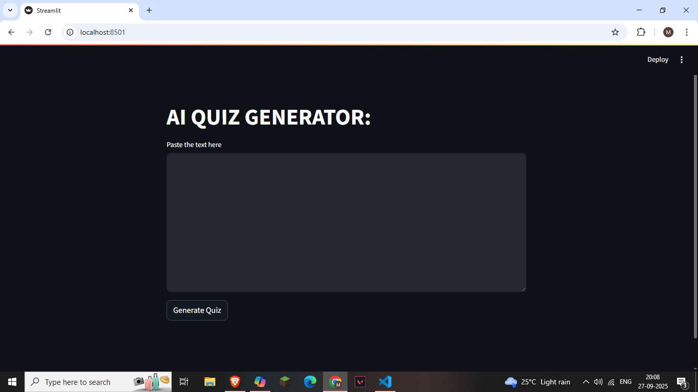
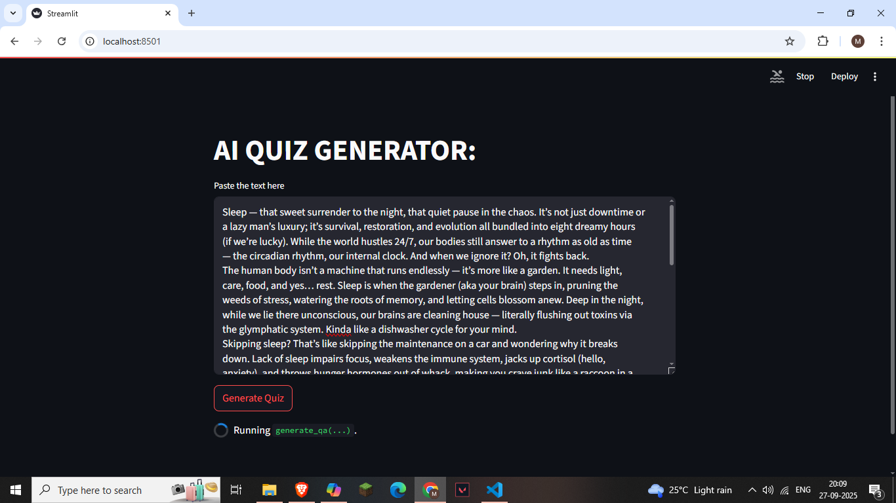
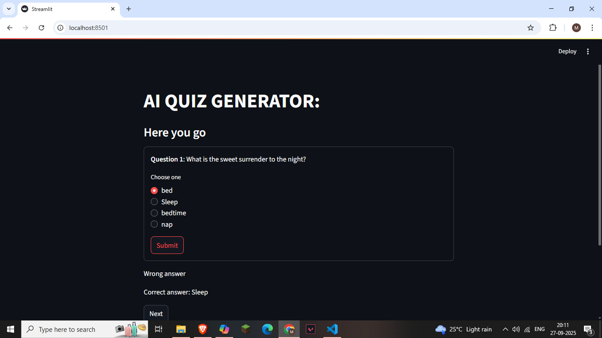

```markdown
# SmartQ 🧠✨  
**AI‑powered Quiz Generator**

[](https://www.python.org/)  
[](https://streamlit.io/)  
[](LICENSE)  
[](https://huggingface.co/transformers/)  

---

## 📖 Overview  
SmartQ is a smart tool that converts any text into interactive quizzes. Powered by NLP and AI models, it generates questions, answers, and distractors, allowing users to test their knowledge quickly and efficiently.  

Built with **Streamlit** for a clean and user‑friendly interface, SmartQ leverages **NLTK**, **transformer‑based models**, and **SentenceTransformers** to create realistic multiple‑choice quizzes.  

---

## 🚀 Features  
- **Automated Question Generation** – Creates intelligent, context‑based questions from user input text.  
- **Accurate Answer Extraction** – Uses advanced QA models to fetch precise answers.  
- **Distractor Creation** – Generates challenging alternative options to make quizzes realistic.  
- **Interactive UI** – Users can attempt quizzes directly in the Streamlit app, track their scores, and restart anytime.  
- **Scalability** – Works with both short and long texts, making it useful for students, educators, and professionals.  

---

## 🛠️ Tech Stack  
- **Python**: 3.12.8  
- **Libraries**:  
  - streamlit==1.47.0  
  - pandas==2.3.1  
  - nltk==3.9.1  
  - transformers==4.41.2  
  - sentence-transformers==5.0.0  
  - torch==2.7.1  

---

## 📦 Installation  
Clone the repository and install dependencies:  
```bash
git clone https://github.com/Aziz-coder-cell/smartq.git
cd smartq
pip install -r requirements.txt
```

---

## ▶️ Usage  
Run the Streamlit app:  
```bash
streamlit run main_quiz.py
```

---

## 🎯 Output  
The program generates a multiple‑choice quiz from the given text.  
- Each question has **4 options** (1 correct + 3 distractors).  
- The Streamlit UI provides instant feedback and a final score.  

**Example:**  
```
Question 1: What does NLP stand for?
Options:
 - Natural Language Processing ✅
 - Neural Linguistic Program
 - Network Language Protocol
 - Node Logic Parser
```

---

## 📸 Screenshots  
Here’s a quick look at SmartQ in action:  

- **Landing Page / Input Text**  
    

- **Generating Quiz from Input**  
    

- **Interactive Quiz with Feedback**  
    


---

## 📊 Model Performance & Evaluation  

SmartQ’s question generation and distractor creation were evaluated using a combination of **automated checks** and **manual review**.  

### 🔎 Evaluation Methodology  
- **Question Accuracy** → Checked if generated questions correctly reflected the source text.  
- **Options Accuracy** → Verified that the correct option was present and phrased reasonably.  
- **Answer Accuracy** → Compared selected answers against the source text.  
- **Combined Accuracy** → Averaged across all three metrics to measure overall alignment.  

### 📈 Results (26 questions evaluated)  
- **Question Accuracy**: **100%**  
- **Options Accuracy**: **≈77%**  
- **Answer Accuracy**: **≈77%**  
- **Combined/Model Accuracy**: **≈85%**  

### ✅ Key Insights  
- Questions were **highly aligned** with the source text (100%).  
- Most errors came from **options and answers**, where distractors were sometimes misaligned or too ambiguous.  
- Overall, SmartQ achieved **~85% accuracy**, showing strong reliability in generating meaningful quizzes.  

### ⚠️ Limitations  
- Performance may vary with highly technical or ambiguous text.  
- Distractor generation occasionally produces overly similar or trivial options.  

---

## 📌 License  
This project is licensed under the **MIT License** — see the [LICENSE](LICENSE) file for details.
